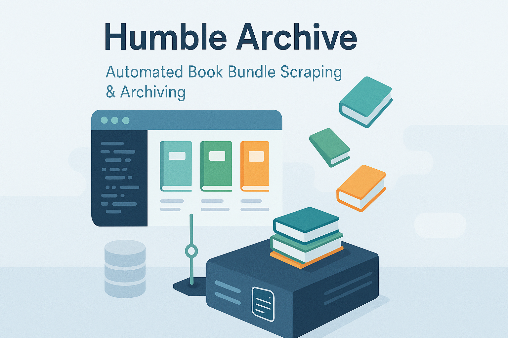

# Humble Archive

<p align="center">
  
</p>

> [!IMPORTANT]
> Please be respectful of the rate limits of the website that you get your data from.
> Do not scrape the website too frequently.
> For personal & non-commercial use only.
> Please comply with the terms of service of the website that you get your data from.
> This is a personal project and is not affiliated with Humble Bundle in any way.

A full-stack web application that scrapes book information from a Humble Books Bundle sale URL, extracts book titles, edition details, and image URLs, then stores the data in a SQLite database. Built with Domain-Driven Design principles.


## 🏗️ Architecture

The application follows Domain-Driven Design (DDD) principles with clear separation of concerns:

```
hb_scrapper/
├── server/                 # Backend API server
│   ├── src/
│   │   ├── domain/         # Domain layer (DDD)
│   │   │   ├── entities/   # Business entities
│   │   │   ├── repositories/ # Repository interfaces
│   │   │   ├── services/   # Domain services
│   │   │   └── value-objects/ # Value objects
│   │   ├── infrastructure/ # Infrastructure layer
│   │   │   ├── database/   # Database implementations
│   │   │   ├── scrapers/   # Web scraping services
│   │   │   └── web/        # Express app and routes
│   │   ├── application/    # Application layer
│   │   │   ├── controllers/ # Request handlers
│   │   │   ├── dto/        # Data transfer objects
│   │   │   └── middleware/ # Express middleware
│   │   └── main.js         # Server entry point
│   └── database/           # SQLite database files
└── client/                 # Frontend Vue application
```

## 📋 API Endpoints

### POST /api/scrape-data

Scrape books from a URL and store them in a group.

**Request Body:**

```json
{
  "url": "https://example.com/books",
  "groupName": "Computer Science Books"
}
```

**Response:**

```json
{
  "success": true,
  "data": {
    "groupId": 1,
    "groupName": "Computer Science Books",
    "booksScraped": 15,
    "message": "Successfully scraped 15 books"
  }
}
```

### GET /api/groups

Get all book groups with pagination.

**Query Parameters:**

- `page`: Page number (default: 1)
- `limit`: Items per page (default: 10, max: 50)

### GET /api/groups/:id/books

Get all books in a specific group with pagination.

**Query Parameters:**

- `page`: Page number (default: 1)
- `limit`: Items per page (default: 20, max: 100)

## 🛠️ Installation & Setup

### Prerequisites

- Node.js 18+
- npm or yarn

### Backend Setup

1. **Navigate to server directory:**

```bash
cd server
```

2. **Install dependencies:**

```bash
npm install
```

3. **Copy environment file:**

```bash
cp env.example .env
```

4. **Start the server:**

```bash
# Development mode
npm run dev

# Production mode
npm start
```

The server will start on `http://localhost:3001`

### Frontend Setup

The Vue.js frontend will be implemented in the `client/` directory with three main routes:

- `/` - Main scraping interface
- `/groups` - Groups listing page
- `/groups/:id` - Group details with books

## 🧪 Testing

### Test the API

1. **Health Check:**

```bash
curl http://localhost:3001/health
```

2. **API Documentation:**

```bash
curl http://localhost:3001/
```


3. **Manual API Testing:**

```bash
# Scrape books
curl -X POST http://localhost:3001/api/scrape-data \
  -H "Content-Type: application/json" \
  -d '{"url": "https://example.com/books", "groupName": "Test Books"}'

# Get groups
curl http://localhost:3001/api/groups

# Get books in a group
curl http://localhost:3001/api/groups/1/books
```

## 🗄️ Database Schema

### Book Groups Table

```sql
CREATE TABLE book_groups (
    id INTEGER PRIMARY KEY AUTOINCREMENT,
    name TEXT NOT NULL UNIQUE,
    books_count INTEGER DEFAULT 0,
    created_at DATETIME DEFAULT CURRENT_TIMESTAMP,
    updated_at DATETIME DEFAULT CURRENT_TIMESTAMP
);
```

### Books Table

```sql
CREATE TABLE books (
    id INTEGER PRIMARY KEY AUTOINCREMENT,
    title TEXT NOT NULL,
    edition TEXT,
    image_url TEXT,
    source_url TEXT NOT NULL,
    group_id INTEGER NOT NULL,
    created_at DATETIME DEFAULT CURRENT_TIMESTAMP,
    FOREIGN KEY (group_id) REFERENCES book_groups(id) ON DELETE CASCADE
);
```

## 🔧 Configuration

### Environment Variables

| Variable        | Description           | Default               |
| --------------- | --------------------- | --------------------- |
| `PORT`          | Server port           | 3001                  |
| `CLIENT_URL`    | Frontend URL for CORS | http://localhost:3000 |
| `DATABASE_PATH` | SQLite database path  | ./database/books.db   |


## 📊 Error Handling

All errors follow a consistent format:

```json
{
  "success": false,
  "error": "Error message",
  "code": "ERROR_CODE",
  "details": "Additional details (optional)"
}
```

### Common Error Codes

- `INVALID_URL`: Malformed or inaccessible URL
- `SCRAPING_FAILED`: Failed to scrape the provided URL
- `GROUP_EXISTS`: Group name already exists
- `GROUP_NOT_FOUND`: Requested group doesn't exist
- `VALIDATION_ERROR`: Request validation failed

## 🚀 Development

### Project Structure

- **Domain Layer**: Business logic and entities
- **Infrastructure Layer**: Database and external services
- **Application Layer**: Controllers and DTOs
- **Web Layer**: Express routes and middleware

### Adding New Features

1. Define domain entities and value objects
2. Create repository interfaces
3. Implement infrastructure layer
4. Add application layer controllers
5. Create API endpoints
